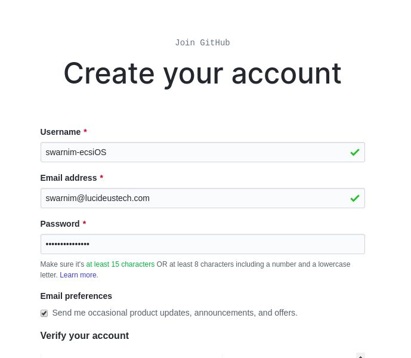
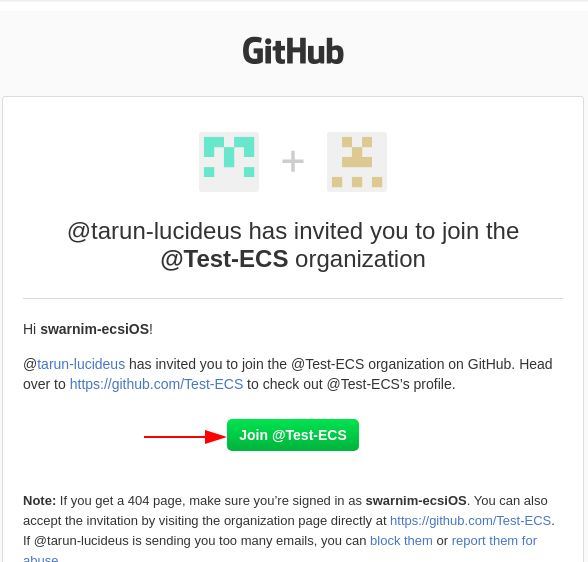
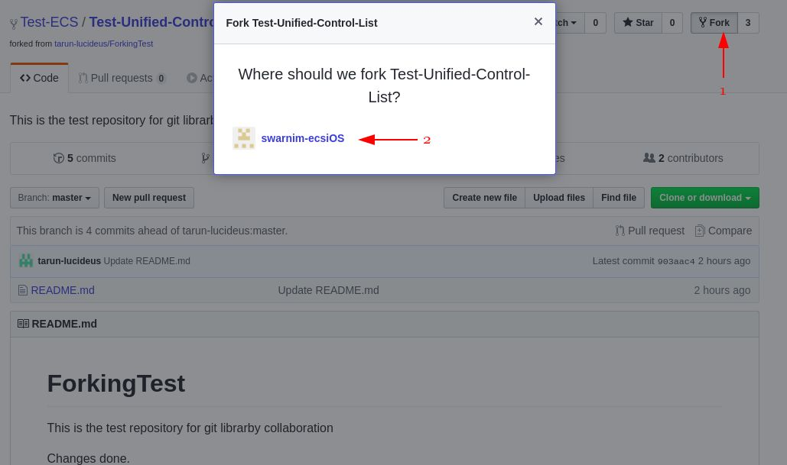
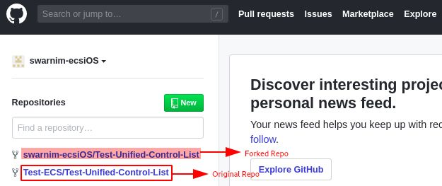
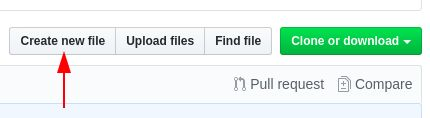
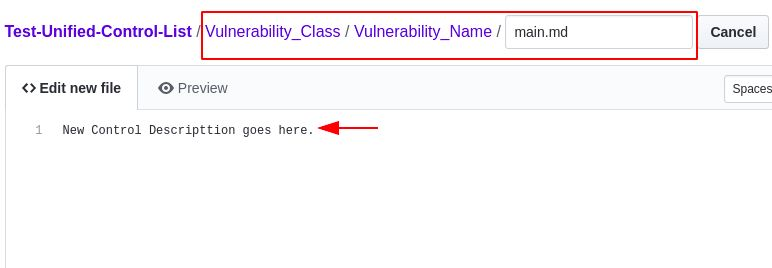
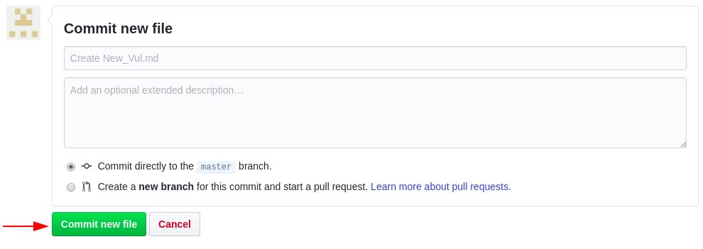

# UCL - Unified Control List
The aim of the UCL is to provide the security analysts with the platform to maintain the repository of ever evolving cyber threats at one place. Moreover, the security assessment control checklist should always be in sync and updated with the latest controls to eliminate false negative results.

## Introduction

UCL is a unified list of security controls/vulnerabilities and test cases applicable on Web, Android and iOS application security. All the vulnerabilities are compliant to various global security standards such as OWASP, CWE etc.

Each and every vulnerability (test cases) in UCL contains the following:
* **Vulnerability ID** - Unique ID assigned to each vulnerability
* **Control Group** - High level vulnerability group such Authentication, Authorization etc.
* **Tentative Severity** - Risk rating of the vulnerability
* **Description** - Brief explanation of the identified vulnerability
* **Audit Guidelines** - Automated and Manual steps to check the presence of vulnerability
* **Impact** - Impact of the vulnerability on an individual, organisation or infrastructure
* **Recommendations** - Recommended patch to mitigate the vulnerability
* **Classification** - Vulnerability mapping to the security standards
* **References** - External links to provide more information about the vulnerability
* **Applicability** - Vulnerability applicability: Applications Traffic/Web Traffic/Android-Static/Android-Dynamic/iOS-Static/iOS-Dynamic
* **Verticals** - Vulnerability verticals: Applications/Web/Android/iOS/Network

Security analysts across teams can contribute to UCL in order to add/delete/modify the security controls. To know more, refer to the [UCL process document](Process.pdf)

## Detailed Steps

* ### Create Github Account
    1.  Go to [Github](https://github.com).
    2.  Click on Sign Up.
    3.  Enter all the details.

    ​
    
    4.  You are good to go now. Let’s contribute now.

* ### Fork the Repository
    1.  You will receive an email invite to join the organization. Join the organisation.

    ​ 

    2.  Go to the organisation’s repository.
    3.  Click on ​**Fork**​ and select your username.

    

    4.  You can see the forked repository in your profile.

    

* ### Adding a New Control
    1.  Click on ​**Create new file**​ .

    

    2.  Use **/** to create directories and subdirectories and create a **main**(.md) file to add control details. e.g *Vulnerability-Class/Vulnerability-Name/main.md*. You can also create a new file at specific folder inside the path *Vulnerability-Class Vulnerability-Name/* for existing vulnerabilities.

    

    3.  Write the details of new controls.
    4.  Commit the changes.

     

     
        

## Reviewer Authority
For pull request in each practice, three reviewers are required. Out of these three reviewers, the mandatory two are mentioned below and the third one is optional.
* **iOS** - Sahil Pahwa & Vibhav Dudeja
* **Android** - Silky Choudhary & Rubal Jain
* **Traffic Analysis/Web** - Deepak Pawar & Rishu Ranjan
